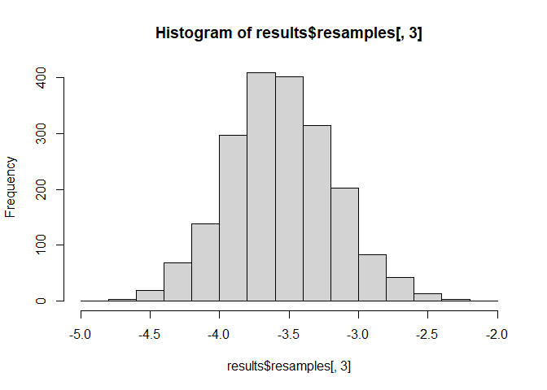

<!-- README.md is generated from README.Rmd. Please edit that file -->

# mlboot

The goal of *mlboot* is to provide a powerful, flexible, and
user-friendly way to estimate and compare the performance of machine
learning (and other predictive) models using bootstrap resampling. It
was created in collaboration by [Jeffrey Girard](https://jmgirard.com/)
and [Zhun Liu](http://justin1904.github.io/); this version for R is
maintained by Jeffrey Girard and a similar version for Python is
maintained by Zhun Liu.

## Installation

``` r
devtools::install_github("jmgirard/mlboot")
```

## Rationale

Bootstrapping is a good choice for estimating the performance of machine
learning models because it can be adapted to nearly any type of
performance metric, does not make parameteric assumptions about their
distributions, and can be quite accurate with relatively little data
(e.g., it has been suggested that bootstrapping is appropriate for
sample sizes as low as 20, although larger samples obviously confer many
benefits). Furthermore, bootstrap confidence intervals provide easily
understood information about the precision and reliability of
performance estimates and readily extend to statistical comparison.

## Usage

### Estimating the performance of a single model

We can simulate some simple labels and predictions to demonstrate this.
Let’s say we have data from 1000 videos and we are trying to predict
ratings of each video’s perceived sentiment (i.e.,
positivity-versus-negativity) on a scale from 0 to 100. We train a
machine learning model on separate data and then generate predictions
for each of the 1000 videos just described. We can calculate the
performance of this model as the mean absolute error (MAE) across all
1000 videos. However, it would also be nice to know how precise or
reliable this estimate is, i.e., how much it is likely to vary as a
function of sampling error. To estimate this precision, we can construct
a confidence interval around the observed MAE value using bootstrap
resampling.

``` r
# Load the mlboot package
library(mlboot)

# Generate random numbers to simulate trusted labels
ratings <- rnorm(n = 1000, mean = 50, sd = 10)

# Perturb the trusted labels to simulate predictions
model1 <- ratings + rnorm(n = 1000, mean = 10, sd = 5)

# Combine variables into a dataframe
dat <- data.frame(ratings, model1)

# Estimate performance of the simulated predictions using the MAE performance metric
mlboot(
  .data = dat,
  trusted = "ratings",
  predicted = "model1",
  metric = mean_absolute_error
)
#> mlboot Results
#> 
#> Sample:          N=1000, Clusters=NA
#> Bootstrap:       BCa, R=2000, CI=0.95
#> Metric:          mean_absolute_error
#> 
#>          Estimate   Lower.CI   Upper.CI   Sig.
#> model1       10.1       9.76       10.4      *
```

The output shows that the observed performance (MAE) in the simulated
sample was 10.063. This is quite close to the perturbation of 10 that we
added to create the labels, which is a good sign that our metric
function is working properly. The output also shows a 95% confidence
interval around the observed sample statistic; thus, we can be quite
confident that the “true” population value of the performance metric is
between 9.749 and 10.349. Given that our sample of 1000 videos is
arbitrary, repeating the experiment with another 1000 videos would
likely result in a different performance score - but the confidence
interval suggests that the MAE shouldn’t vary more than 0.3 or so.

### Estimating and comparing the performance of two models

Now let’s say we develop another model that is much more accurate. We
can use a very similar approach (and indeed the same function call, with
additional arguments) to estimate the performance of this second model
and assess the degree to which the models differ in performance.

``` r
# Perturb the trusted labels to a lesser degree to simulate better predictions
model2 <- ratings + rnorm(n = 1000, mean = 5, sd = 5)

# Append to existing dataframe
dat2 <- cbind(dat, model2)

# Estimate performance of both models and compare them using the MAE metric
mlboot(
  .data = dat2,
  trusted = "ratings",
  predicted = c("model1", "model2"),
  metric = mean_absolute_error,
  pairwise = TRUE
)
#> mlboot Results
#> 
#> Sample:          N=1000, Clusters=NA
#> Bootstrap:       BCa, R=2000, CI=0.95
#> Metric:          mean_absolute_error
#> 
#>                   Estimate   Lower.CI   Upper.CI   Sig.
#> model1               10.06       9.77      10.35      *
#> model2                5.92       5.69       6.18      *
#> model1 - model2       4.14       3.74       4.48      *
```

The output shows the same observed performance for the first model,
although the confidence interval is slightly different due to the
stochastic nature of resampling. (If more consistent confidence interval
bounds are desired, additional bootstrap resamples can be requested
using the `nboot` argument.) The second model had an observed
performance score of 5.925 which is indeed lower than that of the first
model. To determine whether this difference is statistically significant
(i.e., likely to be replicated with another sample), we can estimate the
average difference between the performance scores of the models. The
observed difference was 4.138 and the confidence interval extends from
3.738 to 4.484 Because the confidence interval does not include zero
(and indeed is not particularly close to zero), we can conclude with 95%
confidence that the second model has a lower mean absolute error than
the first model.

### Using the cluster bootstrap for hierarchical data

It is common in many areas of applied machine learning to have testing
sets that are hierarchical in structure. For example, there may be
multiple testing examples that are clustered (e.g., come from the same
individuals or groups) and therefore are not independent. Ignoring this
dependency would result in biased estimates, so we need to account for
it in some way. Although hierarchical resampling is an active area of
research, two recent studies (Field & Welsh, 2007; Ren et al. 2010)
suggest that the cluster bootstrap is an accurate and powerful approach
to this issue. By supplying a vector indicating cluster membership for
each testing example, `mlboot()` can implement the cluster bootstrap
procedure. Note that this approach may lead to inaccuracies when the
number of clusters is low (e.g., fewer than 20).

``` r
# Assume the examples come from 50 different clusters corresponding to persons
person <- rep(1:50, each = 20)

# Generate random numbers to simulate trusted labels
ratings <- rnorm(n = 1000, mean = 20 + person, sd = 10)

# Perturb the trusted labels to simulate predictions
model1 <- ratings + rnorm(n = 1000, mean = 10 - person, sd = 5)
model2 <- ratings + rnorm(n = 1000, mean = 5 - person, sd = 5)

# Combine variables into dataframe
dat3 <- data.frame(person, ratings, model1, model2)

# Estimate and compare the models using the cluster bootstrap
mlboot(
  .data = dat3,
  trusted = "ratings",
  predicted = c("model1", "model2"),
  metric = mean_absolute_error,
  cluster = person,
  pairwise = TRUE
)
#> mlboot Results
#> 
#> Sample:          N=1000, Clusters=50
#> Bootstrap:       BCa, R=2000, CI=0.95
#> Metric:          mean_absolute_error
#> 
#>                   Estimate   Lower.CI   Upper.CI   Sig.
#> model1               17.83      14.75      21.34      *
#> model2               21.30      17.80      25.17      *
#> model1 - model2      -3.48      -4.18      -2.53      *
```

### Visualizing bootstrap results

``` r
results <- 
  mlboot(
    .data = dat3,
    trusted = "ratings",
    predicted = c("model1", "model2"),
    metric = mean_absolute_error,
    cluster = person,
    pairwise = TRUE
  )

hist(results$resamples[, 3])
```



## Code of Conduct

Please note that the ‘mlboot’ project is released with a [Contributor
Code of Conduct](.github/CODE_OF_CONDUCT.md). By contributing to this
project, you agree to abide by its terms.

## References

Efron, B., & Tibshirani, R. J. (1993). *An introduction to the
bootstrap.* New York, NY: Chapman and Hall.

Field, C. A., & Welsh, A. H. (2007). Bootstrapping clustered data.
*Journal of the Royal Statistical Society: Series B (Statistical
Methodology), 69*(3), 369–390. <https://doi.org/10/cqwx5p>

Ren, S., Lai, H., Tong, W., Aminzadeh, M., Hou, X., & Lai, S. (2010).
Nonparametric bootstrapping for hierarchical data. *Journal of Applied
Statistics, 37*(9), 1487–1498. <https://doi.org/10/dvfzcn>
